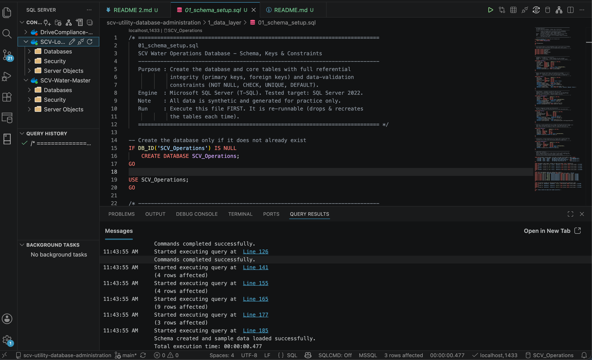
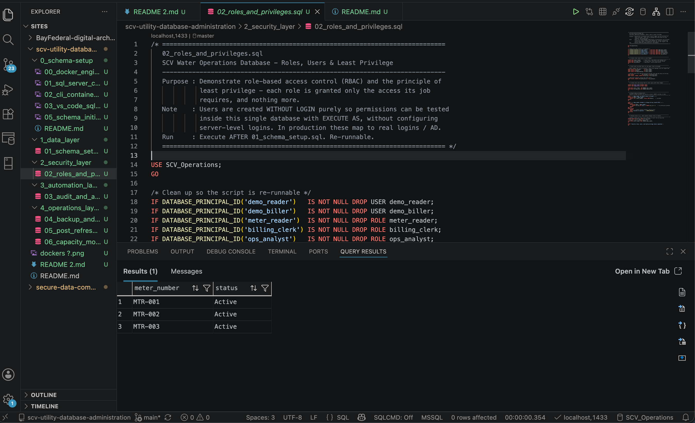
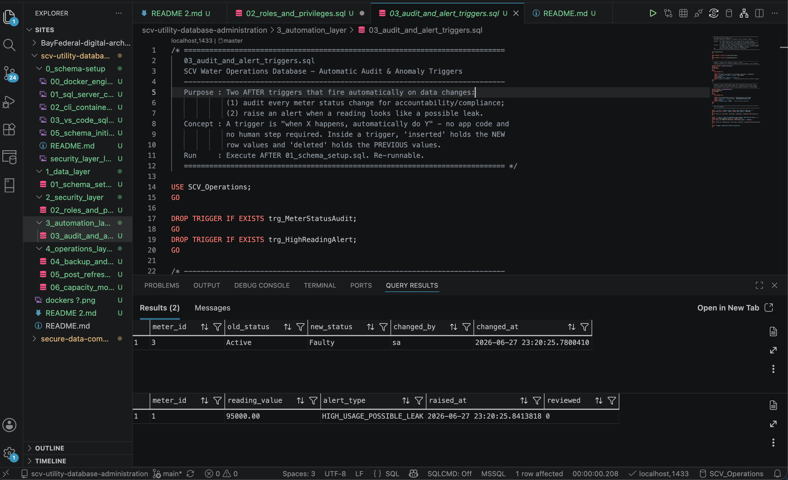
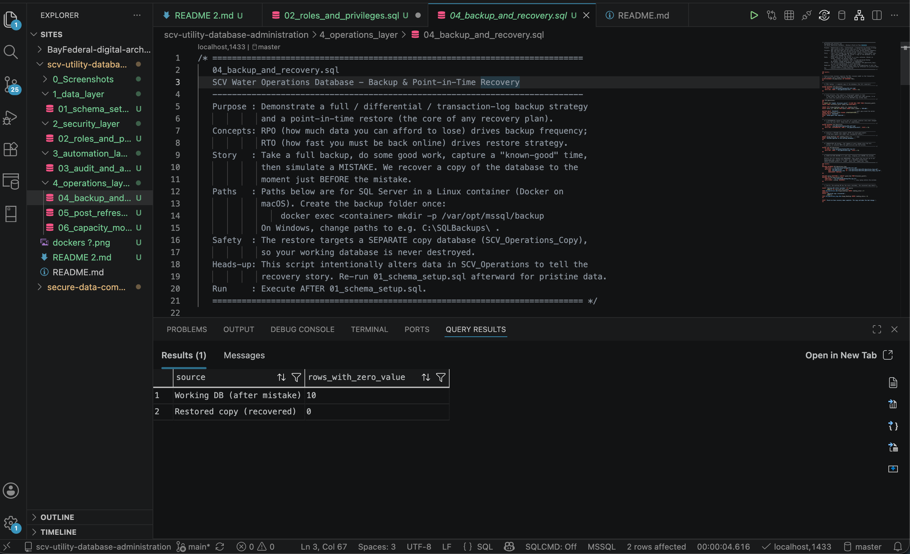
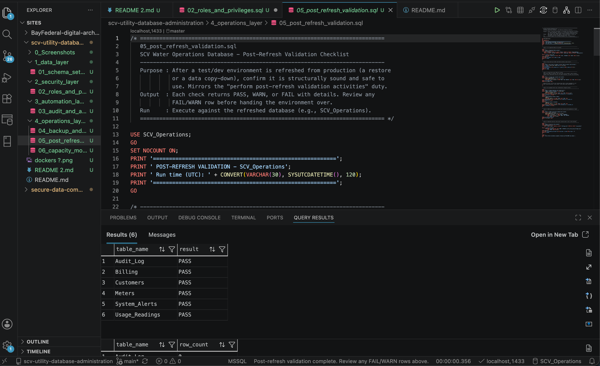
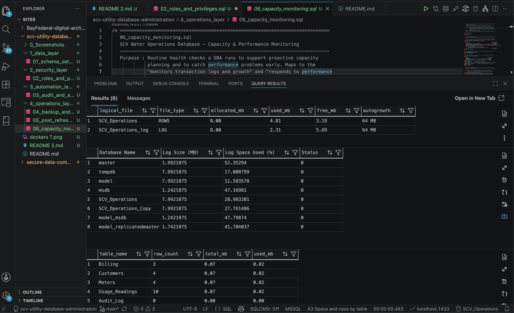
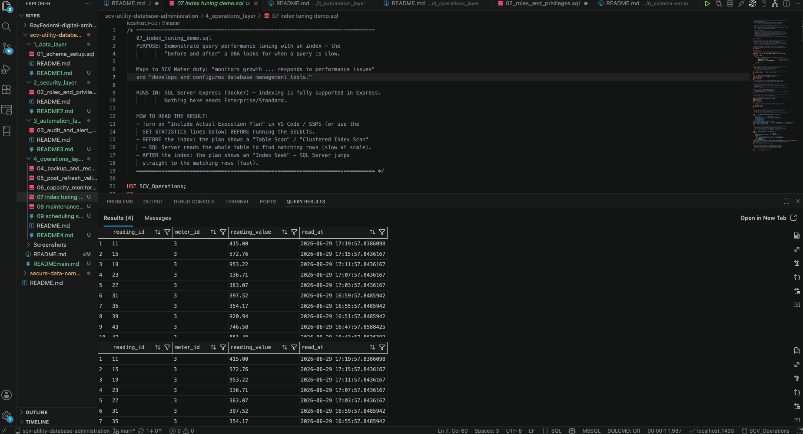
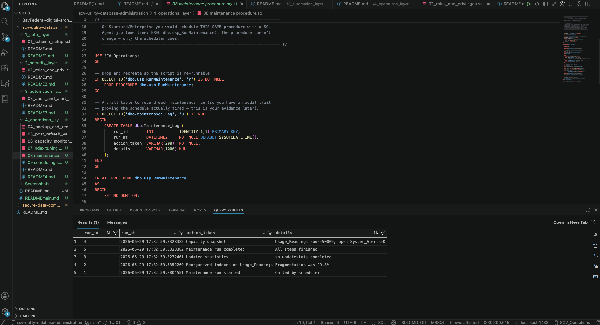

# 🌊 SCV Water Operations Database — DBA Sandbox

**A working, end-to-end SQL Server database administration project, built to mirror the day-to-day duties of the SCV Water Information Technology Specialist role.**

Not a tutorial copy and not a slide deck — a runnable database with schema, security, automation, recovery, monitoring, performance tuning, and scheduled maintenance, all modeled on water-utility operations and mapped directly to the job description.

> ⚠️ **Sandbox note:** This is a local development environment. All schemas, tables, and records are fictional and synthetically generated for practice.

---

## 🎯 Why I built this
I'm returning to technology after a planned career break, and I wanted to *demonstrate* the skills this role calls for rather than only claim them. So I built the database the posting describes — from the ground up in SQL Server — and ran every piece. Everything here is something I can run, explain, and defend.

---

## 🚰 Real-World Context & Design Intent

This project is modeled on a regional water utility — the **Santa Clarita Valley Water Agency (SCV Water)**, which serves a population of roughly **294,000 through about 75,000 service connections** (metered accounts) — so the schema and operations reflect a real operational domain rather than abstract examples. A "service connection" is a metered account, which is exactly what this project's `Customers` and `Meters` tables model.

**A note on scale (honest scoping):** This is a sandbox with synthetic sample data, *not* a production-scale dataset. The schema is **designed** with the relationships, keys, and data types a system would need to **scale** toward that many connections — the database-design fundamentals that keep queries efficient as data grows — but it has **not** been load-tested at that volume.

**Why these layers:** A public water agency's priorities — reliability, data protection, and planning for emergencies like droughts, fires, and earthquakes — map naturally onto core database-administration work:

- **Data protection & public trust** → role-based, least-privilege access (`2_security_layer/02`)
- **Resilience & recovery** → backups and point-in-time restore, so data can be recovered to the moment before a failure (`4_operations_layer/04`)
- **Early warning** → triggers that automatically flag abnormal readings — the same pattern used to catch a leak or usage spike early (`3_automation_layer/03`)
- **Staying healthy as data grows** → capacity monitoring, index tuning, and scheduled maintenance (`4_operations_layer/06`–`09`)

The goal is to show the database-administration skills this role calls for, applied to a realistic operational context — honestly scoped as a demonstration, not a production deployment.

---

## 🗺️ How each layer maps to the job bulletin

- **Data Layer** (`1_data_layer/01_schema_setup.sql`) — a normalized six-table schema with primary/foreign keys and `NOT NULL` / `CHECK` / `UNIQUE` constraints enforcing integrity at the engine level.
  → *"Installs, configures, and maintains SQL data servers... ensuring smooth and efficient database functionality."*
- **Security Layer** (`2_security_layer/02_roles_and_privileges.sql`) — database roles and least-privilege `GRANT`/`REVOKE`, with a test that confirms a restricted role is correctly blocked.
  → *"Manages user accounts, roles, and privileges to ensure data security; performs regular audits."*
- **Automation Layer** (`3_automation_layer/03_audit_and_alert_triggers.sql`) — triggers that log meter status changes and flag abnormally high readings automatically.
  → *"Develops, validates, and deploys scripts for database operations."*
- **Operations Layer** (`4_operations_layer/04`–`09`) — full / differential / log backups with point-in-time restore, a post-refresh validation checklist, capacity & performance monitoring, query performance tuning with indexing (before/after execution plans), and routine maintenance bundled into a logged procedure that runs on a schedule.
  → *"Performs regular database backups; develops and tests recovery plans; monitors growth and performance; develops and configures database management tools."*

---

## 🏗️ How it's organized

```
scv-utility-database-administration/
├── 1_data_layer/          → schema, keys, constraints, sample data
├── 2_security_layer/      → roles, users, least-privilege GRANT/REVOKE
├── 3_automation_layer/    → audit-log and anomaly-alert triggers
├── 4_operations_layer/    → backups + recovery, validation, monitoring, tuning, scheduled maintenance
└── Screenshots/           → screenshots of the scripts running on the live environment
```

Each layer folder has its own README with a data dictionary and details.

---

## 🖥️ Proof it runs
Each stage was executed on the live SQL Server container. The screenshots below show the results (the full set is in the `Screenshots/` folder).

**Schema build**

*The schema script running on the live container — tables created and synthetic sample data loaded.*

**Least privilege enforced**

*A restricted role is correctly blocked from an action it isn't permitted to perform — access is enforced by the engine, not just documented.*

**Triggers fire automatically**

*A meter status change is logged to the audit table and an abnormally high reading raises a leak alert — automatically, with no application code.*

**Point-in-time recovery**

*A copy of the database restored to the moment just before a simulated bad change, recovering the correct data.*

**Post-refresh validation**

*The validation checklist returning PASS across the environment-integrity checks.*

**Capacity & performance**

*File and log space, autogrowth settings, and index usage — the routine checks behind capacity planning.*

**Query performance tuning — before and after**

*The same query before and after adding an index: a full table scan becomes an index seek, with logical reads dropping sharply.*

**Automated maintenance ran on schedule**

*The maintenance log with rows added automatically by the scheduler minutes apart — proof the routine ran on its own, with no manual execution.*

---

## ⚙️ Tech stack
**SQL Server** (Express) · **T-SQL** (DDL / DML / DCL) · **Docker** on macOS · **Visual Studio Code** with the `mssql` extension

**Local setup:** Ran SQL Server in a Docker container with the database port mapped to the local host (`1433`) for client access via VS Code.

---

## ▶️ Run it yourself
Start a SQL Server container, then run in order:
1. `1_data_layer/01_schema_setup.sql` *(first — builds the database and sample data)*
2. `2_security_layer/02_roles_and_privileges.sql`
3. `3_automation_layer/03_audit_and_alert_triggers.sql`
4. `4_operations_layer/06_capacity_monitoring.sql` and `05_post_refresh_validation.sql`
5. `4_operations_layer/07_index_tuning_demo.sql` *(turn on the actual execution plan to see the scan → seek difference)*
6. `4_operations_layer/08_maintenance_procedure.sql`, then follow `4_operations_layer/09_scheduling_setup.md` to schedule it

`4_operations_layer/04_backup_and_recovery.sql` is a self-contained recovery demonstration that intentionally alters data — run it on its own, then re-run `01_schema_setup.sql` for pristine data. Create the backup folder once with `docker exec <container> mkdir -p /var/opt/mssql/backup`.

> **Note on scheduling:** SQL Server Express has no SQL Server Agent, so the maintenance procedure is scheduled with cron inside the container (see `09_scheduling_setup.md`). On Standard/Enterprise the same procedure would run as a one-line SQL Agent job — the skill is identical, only the scheduler differs.

---

## 📌 About
Built as part of a deliberate, hands-on return to technology, to demonstrate the specific database administration skills this role requires. A focused sandbox with synthetic data — and still growing.
