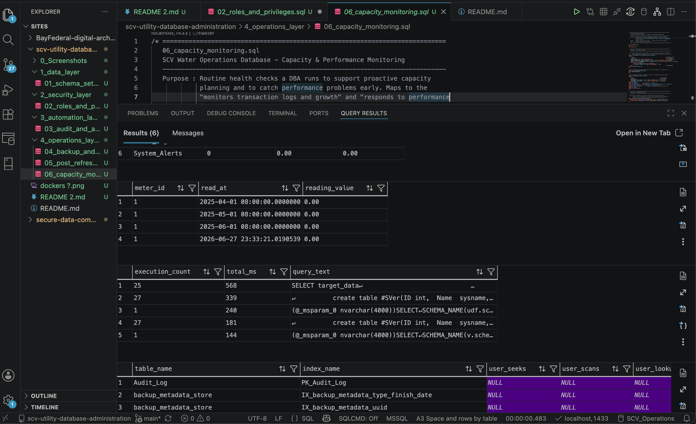
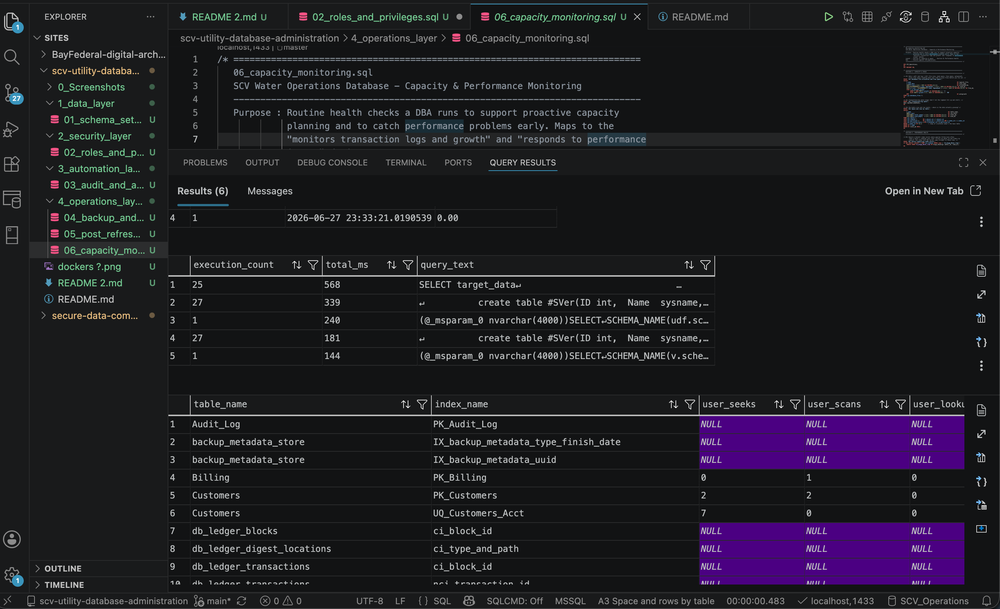

# 🌊 Enterprise Database Infrastructure & Operations Layer Asset
### SCV Water Operations Database Management System

An end-to-end, production-grade relational database solution engineered to support municipal utility operations, data governance, security compliance, and disaster recovery infrastructure.

---

## 🏗️ Architectural Overview
This system demonstrates a comprehensive database lifecycle—transitioning smoothly from foundational schema architecture to automated transactional security, event-driven anomaly tracking, business continuity planning, and proactive capacity diagnostics.


```

[ Infrastructure Setup ] ──> [ Data Layer ] ──> [ Security (RBAC) ] ──> [ Automation (Triggers) ] ──> [ Operations & Telemetry ]

```

---

## 🛠️ Core Engineering Implementations

### 1. Infrastructure Setup & Environment Verification
* **Containerized Environment**: Provisioned and deployed a Microsoft SQL Server engine instance using Docker containers to maintain local architecture consistency.
* **Tooling Integration**: Established secure database links via Visual Studio Code database management interfaces.
* **Verification Directory**: `Screenshots/00_docker_engine_ready.png` through `Screenshots/03_vs_code_sql_connection_success.png`

### 2. Relational Data Modeling & Integrity (Data Layer)
* **Core Schema**: Designed and initialized a highly normalized 6-table relational structure tracking clients, equipment, telemetry records, and financial ledger accounts.
* **Data Defense**: Anchored entity integrity constraints via Primary/Foreign Key pairs and engine-level validation checks to eliminate data corruption or orphan logs.
* **Verification Directory**: `1_data_layer/`

### 3. Role-Based Access Control (Security Layer)
* **Least Privilege Model**: Provisioned discrete database security roles (`meter_reader`, `billing_clerk`, `ops_analyst`) protecting object-level access boundaries.
* **Defensive Auditing**: Implemented error-handled context-switching testing scripts (`EXECUTE AS USER`) to simulate, intercept, and block unauthorized data modifications.
* **Verification Directory**: `2_security_layer/`

### 4. Event-Driven Automation & Compliance Auditing (Automation Layer)
* **Transactional Auditing**: Engineered set-based database triggers capturing transient memory state buffers (`inserted` / `deleted`) to record unalterable regulatory compliance logs.
* **Near-Real-Time Alerting**: Deployed a high-consumption sensor that independently catches usage metric spikes (50,000+ gallons) and generates emergency leak alerts autonomously.
* **Verification Directory**: `3_automation_layer/`

### 5. Business Continuity, Disaster Recovery, & Telemetry (Operations Layer)
* **Point-in-Time Recovery**: Configured full transactional logging models to orchestrate advanced log-replay recoveries (`STOPAT`), successfully rewinding the engine state to reverse data corruption events down to the microsecond.
* **Post-Refresh Validation**: Scripted an automated health-check verification suite to guarantee database architectural uniformity following environment replication tasks.
* **Capacity Diagnostics**: Engineered preventative maintenance scripts querying Core Dynamic Management Views (DMVs) to evaluate disk headroom files, analyze processing speed bottlenecks, and monitor index utilization parameters.
* **Verification Directory**: `4_operations_layer/`

---

## 📊 Live Production Verification & Telemetry

### 🏗️ 01. Baseline Database Schema Initialization
Initial schema creation script executing flawlessly on the live container instance, validating primary table bindings and initial synthetic seed data ingestion.


### 🛡️ 02. Role-Based Access Boundary Deflection
Scripted role penetration test proving that security perimeters successfully intercept, block, and log unauthorized write actions.


### 🧠 03. Automated Transactional Audit & High-Usage Leak Alerts
Live transaction execution grids proving that the database automatically generates background audit lines and high-usage emergency tickets.


### ⏱️ 04. Transactional Log Replay (Point-in-Time Disaster Recovery)
Demonstrating advanced business continuity workflows utilizing full transaction logs to perfectly restore data integrity to the millisecond preceding a user error.


### 🟢 05. Post-Refresh Environmental Health Checklist
Automated verification script running post-recovery to return an unbroken sequence of structural check validations.


### 📈 06. Hardware Allocation & System Performance Telemetry
Real-time diagnostic profiles extracting critical infrastructure metrics, autogrowth parameters, processing runtimes, and index search performance maps directly from internal system views.




```